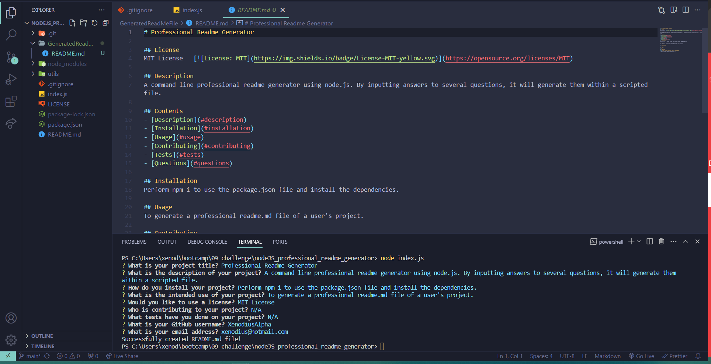

# Professional Readme Generator

## License
MIT License   [](https://opensource.org/licenses/MIT)

## Description
A command line professional readme generator using node.js. By inputting answers to several questions, it will generate them within a pre-scripted file.

## Contents
- [Description](#description)
- [Installation](#installation)
- [Usage](#usage)
- [Contributing](#contributing)
- [Tests](#tests)
- [Questions](#questions)

## Installation
- Clone repository
```bash
git clone https://github.com/XenodiusAlpha/nodeJS_professional_readme_generator.git
```
- Install the dependencies from the package.json file.
```bash
npm install
```
## Usage
1. After installing dependencies, run the command
```bash
node index.js
```
2. Answer every prompt in the terminal.
3. View generated Readme file in the GeneratedReadMeFile folder.

## Contributing
N/A

## Tests
N/A

## Screenshots


## Video link


## Questions
### If you have any questions, you can reach me at:
- GitHub: https://github.com/XenodiusAlpha
- Email address: xenodius@hotmail.com